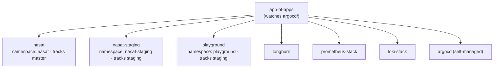
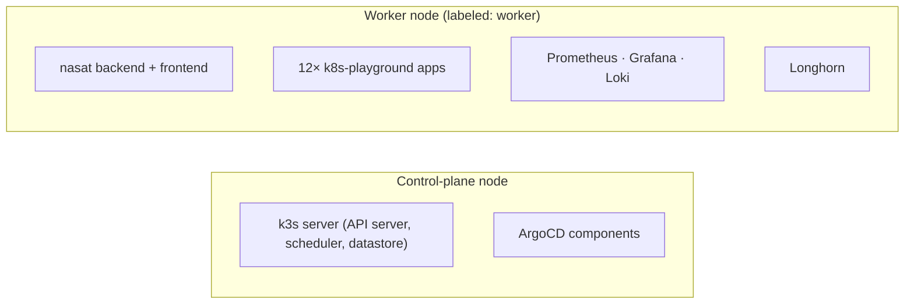

# NASAT


NASAT is two things at once:

1. **A full-stack social app** — Django + DRF backend, React/TypeScript frontend, Postgres, MinIO for media.
2. **A self-hosted GitOps homelab platform** — a two-node K3s cluster run entirely through ArgoCD's app-of-apps pattern, hosting the app itself plus a monitoring stack, Longhorn storage, and a dozen self-hosted "playground" apps (photos, media, notes, automation, DNS, etc.).

If you only skimmed `master`, most of what's below is new here: the app-of-apps layout, Longhorn, Prometheus/Loki, and the entire `k8s-playground/` tree don't exist on `master` yet.

## Repository layout

```
nasat/
├── backend/                    Django REST API
│   ├── apps/
│   │   ├── posts/               Posts, feed
│   │   ├── social/               Follow relationships
│   │   └── users/                 Auth, profiles, relations (family/partner/social ties)
│   ├── config/                    Settings, urls, wsgi
│   └── requirements.txt
├── frontend/                    React + TypeScript (Vite)
│   └── src/
│       ├── components/            Cards, sidebar, relations modal, etc.
│       └── pages/                 Profile, Explore, AddUser, EditUser
├── k8s/                          Manifests for the NASAT app itself
│   ├── backend/  frontend/          Deployments + Services
│   ├── ingress/                      Traefik ingress + MinIO ingress
│   ├── minio/  postgres/             Object storage + database
├── argocd/                       ArgoCD Application definitions (the "app-of-apps" tree)
│   ├── app-of-apps.yaml              Root application — watches this folder
│   ├── argocd.yaml                    → nasat (production, tracks `master`)
│   ├── argocd-staging.yaml            → nasat-staging (tracks `staging`)
│   ├── playground.yaml                → playground (tracks `k8s-playground/`)
│   ├── longhorn.yaml                  → Longhorn storage
│   ├── prometheus-stack.yaml          → kube-prometheus-stack
│   ├── loki-stack.yaml                → Loki logging
│   └── argocd-self.yaml               → ArgoCD manages its own install
├── infrastructure/
│   ├── argocd/                        Raw ArgoCD install manifest + ingress + kustomization
│   ├── longhorn/                       Helm values + storage classes + backup/recurring-job resources
│   └── monitoring/                     Prometheus + Loki Helm values, Grafana dashboards
├── k8s-playground/               12 self-hosted apps, one folder each (see table below)
├── .github/workflows/             CI: build/test/push images, auto-bump image tags in git
├── RELATIONS_GUIDE.md            Design notes for the user-relations feature
├── CODE_OF_CONDUCT.md, LICENSE
└── README.md
```

## The application

| Layer | Stack |
|---|---|
| Backend | Django + Django REST Framework, JWT auth (simplejwt), Gunicorn |
| Database | PostgreSQL |
| Media storage | MinIO (S3-compatible) |
| Frontend | React 18 + TypeScript + Vite |
| Core features | Posts with images, follow/unfollow, and a **relations** system — bidirectional family/partner/social relationship types (mother↔son, wife↔husband, friend↔friend, etc.), surfaced on the profile page and in Explore |

Local dev, API endpoints, and environment variables are unchanged from the standard Django/React workflow — see [Getting started](#getting-started) below.

## Deployment model: one app-of-apps, three environments

Everything in the cluster is owned by a single root ArgoCD `Application` (`argocd/app-of-apps.yaml`), which recursively watches the `argocd/` folder. Every file it finds there becomes its own child `Application`:



- **`nasat`** and **`nasat-staging`** are two live, separate copies of the app — deliberately, so `staging` can be validated before promoting to `master`.
- **`playground`, `longhorn`, `prometheus-stack`, `loki-stack`** are infrastructure — there is intentionally only **one** copy of each. They are not meant to be duplicated the way the app is; there's no useful concept of a "staging Jellyfin."
- Sync is automated (`prune: true`, `selfHeal: true`) everywhere, so the cluster is expected to converge to whatever's in git without manual `kubectl apply`.

## Cluster topology (2 nodes)

The cluster has one control-plane node and one node labeled `node-role.kubernetes.io/worker: worker`. Every workload manifest in this repo — the app, all 12 playground apps, monitoring, and Longhorn — carries a `nodeSelector` pinning it to the worker node:



This is deliberate: it keeps heavy or spiky workloads (Jellyfin transcoding, Immich's ML jobs, Paperless OCR) from starving the node that runs the control plane. The tradeoff is that the worker node carries the entire application load — see [Resource budget](#resource-budget) before enabling everything at once.

## Infrastructure layer

- **ArgoCD** manages itself (`argocd-self.yaml` → `infrastructure/argocd/`), installed from the standard non-HA `install.yaml` (application controller, repo server, API server, redis, dex, notifications, applicationset — 6 Deployments + 1 StatefulSet).
- **Longhorn** provides the default `StorageClass`. Given a 2-node cluster, `defaultReplicaCount` is set to `1`, and the `longhorn-standard`/`longhorn-critical` classes use `numberOfReplicas: 2` (not the usual 3) so volumes can actually satisfy their replica count.
- **Monitoring**: `kube-prometheus-stack` (Prometheus + Grafana, 7-day retention, alerting disabled) and `loki-stack` (single-binary mode), both scraping the K3s kubelet/cAdvisor. Dashboards are pre-provisioned via Grafana's sidecar (`infrastructure/monitoring/dashboards-configmaps/`).

## k8s-playground: self-hosted apps

Twelve independent apps, each with its own namespace, PVC, Service, and Traefik `Ingress` under `*.nasat.local`:

| App | What it is | Image | Host |
|---|---|---|---|
| **Immich** | Self-hosted photo/video library with ML search | `immich-app/immich-server` + bundled Postgres/Redis | immich.nasat.local |
| **Jellyfin** | Media server (movies/TV) | `jellyfin/jellyfin` | jellyfin.nasat.local |
| **Paperless-ngx** | Document management + OCR | `paperlessngx/paperless-ngx` + Postgres + Redis | paperless.nasat.local |
| **n8n** | Workflow automation (Zapier-style) | `n8nio/n8n` | n8n.nasat.local |
| **Pi-hole** | Network-wide ad/DNS blocking | `pihole/pihole` | pihole.nasat.local |
| **Trilium** | Hierarchical note-taking | `triliumnext/trilium` | trilium.nasat.local |
| **Wiki** *(namespace: `jspwiki`)* | Team wiki — currently running Wiki.js, not JSPWiki, despite the folder name | `ghcr.io/requarks/wiki` | jspwiki.nasat.local |
| **FreshRSS** | RSS/feed aggregator | `freshrss/freshrss` | freshrss.nasat.local |
| **Gotify** | Self-hosted push notifications | `gotify/server` | gotify.nasat.local |
| **Uptime Kuma** | Uptime/status monitoring | `louislam/uptime-kuma` | uptime.nasat.local |
| **Linkding** | Bookmark manager | `sissbruecker/linkding` | bookmarks.nasat.local |
| **Homepage** | Dashboard linking to everything above | `gethomepage/homepage` | homepage.nasat.local |

### Resource budget

Nothing here has infinite headroom — these numbers are the sum of what's actually declared in each `deployment.yaml`:

| | Requested | Limit (burst ceiling) |
|---|---|---|
| All 12 playground apps | ~1.75 CPU / ~4.1 Gi | ~10.6 CPU / ~13 Gi |
| Prometheus + Grafana | 50m / 256Mi | 500m / 850Mi |
| Loki | 100m / 256Mi | 500m / 512Mi |

All of this lands on the single worker node (see topology above). Before turning on everything at once, check the worker node's real capacity with `kubectl top nodes` — Immich (ML) and Jellyfin (transcoding) are the apps most likely to actually hit their limits.

## CI/CD

Three GitHub Actions workflows, all triggered on push to `master` or `staging` (path-filtered so backend/frontend changes don't rebuild each other):

- `build-docker-push-bk.yaml` / `build-docker-push-fr.yaml` — install deps, run a smoke test (container must not crash on startup), build and push the Docker image to Docker Hub tagged `:<branch>` and `:<commit-sha>`, then commit the new SHA tag back into `k8s/backend/Backend.yaml` / `k8s/frontend/Frontend.yaml` (`[skip ci]`) so ArgoCD's self-heal picks it up.
- `build-docker-push-all.yaml` — manual `workflow_dispatch` to run both pipelines for a chosen branch on demand.

## Getting started

### Prerequisites
- Docker & Docker Compose, Python 3.12, Node.js 20, `kubectl`

### Backend
```bash
cd backend
python -m venv venv && source venv/bin/activate
pip install -r requirements.txt
python manage.py migrate
python manage.py runserver
```

### Frontend
```bash
cd frontend
npm install
npm run dev
```

### Cluster
```bash
# Bootstrap: install ArgoCD, then hand control to the app-of-apps
kubectl apply -f infrastructure/argocd/install.yaml
```

## API Endpoints

### Authentication
- `POST /api/auth/login/` - Obtain JWT token
- `POST /api/auth/refresh/` - Refresh JWT token

### Users
- `GET/POST /api/users/` - List/create users
- `GET/PUT /api/users/{id}/` - Retrieve/update user profile

### Posts
- `GET/POST /api/posts/` - List/create posts
- `GET/DELETE /api/posts/{id}/` - Retrieve/delete post

### Social
- `POST /api/social/follow/` - Follow a user
- `DELETE /api/social/follow/{id}/` - Unfollow a user
- `GET /api/social/followers/` - Get followers

## Kubernetes Deployment

### Prerequisites
- K3S cluster running
- kubectl configured
- Docker images pushed to registry

### Deploy with ArgoCD
Deploy the application stack using app-of-apps pattern:
```bash
kubectl apply -f argocd/app-of-apps.yaml
```
# Everything else (nasat, nasat-staging, playground, monitoring, longhorn) is
# reconciled automatically from here — do not kubectl apply the individual
# app manifests directly, or you'll fight ArgoCD's self-heal.
```


## Contributing

PEP 8 for Python, TypeScript strict mode for the frontend, meaningful commit messages, test locally before pushing.

## License

MIT — see `LICENSE`.
## Support

For issues or questions, please create an issue in the repository or contact the development team.

---

**Last Updated**: Aug 30, 2026
